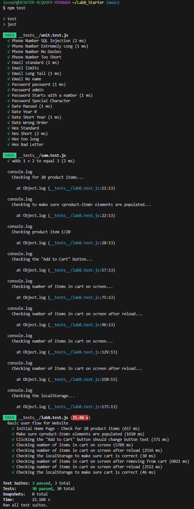

# Lab 8 - Starter

Joseph Del Val

1. Within a GitHub action whenever code is pushed. Automated test should be automated, not run manually, and GitHub actions faciliates this. Additionally, code should be tested as it's written, not once everything is complete.
2. No
3. No, I'd use an E2E test. The message feature has more to do with the user experience, and you'll want to test how it functions on an application level.
4. Yes. This is a straightforward and isolated test that works best with unit testing.